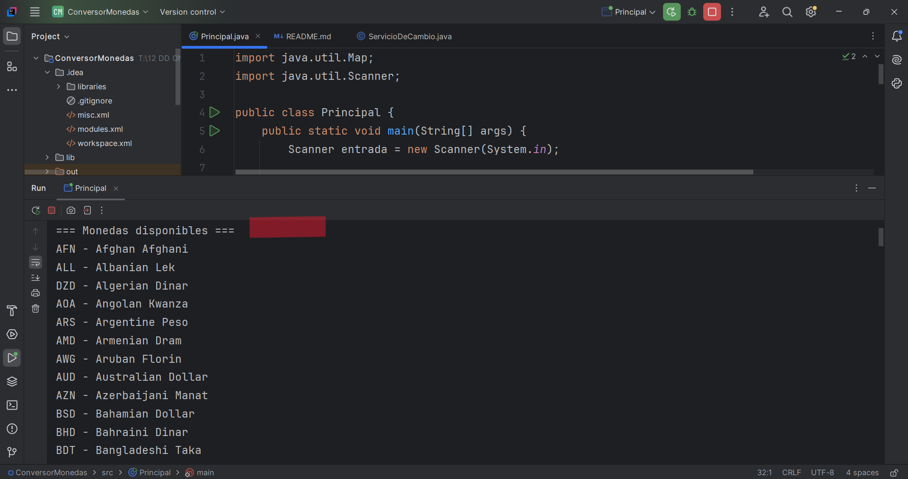
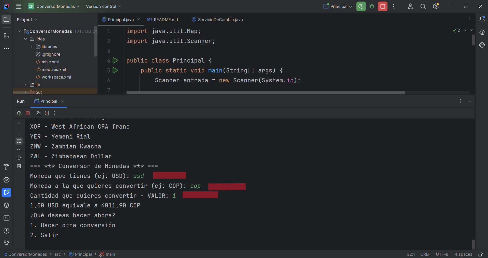
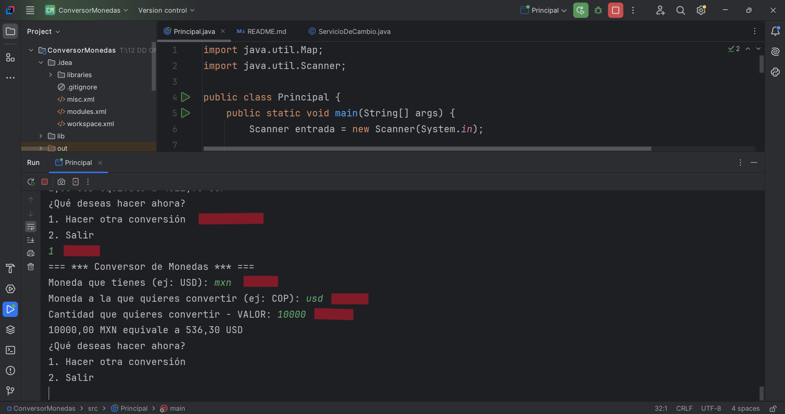
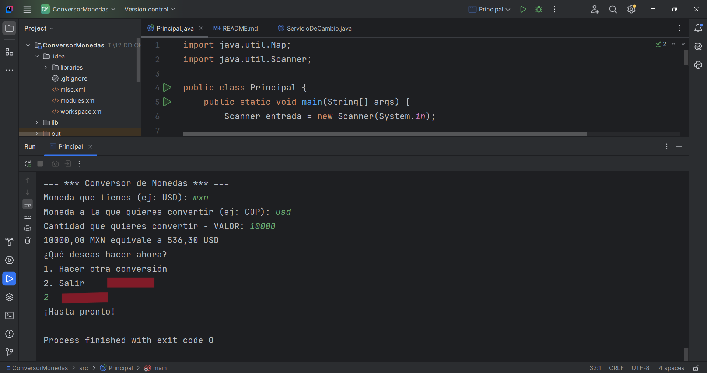
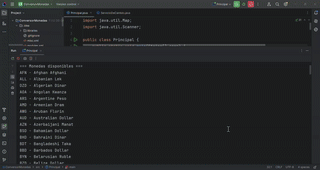

 #  💱 Challenge: Conversor de Monedas

## ✨ ¿Qué hace este programa?
Este programa sirve para convertir una cantidad de dinero de una moneda a otra, usando datos reales de internet.
Por ejemplo, puedes convertir dólares a pesos colombianos, o euros a yenes japoneses.

Todo se hace de forma sencilla desde la consola, y los datos de conversión se actualizan automáticamente gracias a una API confiable.

## 💡 ¿Qué necesitas para usarlo?
Tener Java instalado en tu computador.

Tener acceso a internet (puesto que consulta los datos en línea).

Una clave gratuita de la API de ExchangeRate-API.com.

##  🛠️ ¿Cómo funciona?
🧠 Al iniciar, el programa muestra una lista de monedas disponibles para que elijas.

💬 Te pide que escribas:

La moneda que tienes (por ejemplo: USD) (puedes escribirla en minúscula o mayúscula).

La moneda a la que quieres convertir (por ejemplo: COP)

La cantidad que deseas convertir: Valor.

📲 El programa se conecta a internet, consulta la tasa de cambio y te muestra el resultado.

🔁 Puedes elegir si quieres hacer otra conversión (con el número 1) o salir del programa (con el número 2).

##  📦 ¿Cómo está hecho el programa?
Está hecho con Java puro y se divide en 2 clases principales:

Principal.java: es donde está la conversación con el usuario.

ServicioDeCambio.java: se encarga de conectarse a la API, traer los datos y calcular la conversión.

Además, se usó una biblioteca externa llamada Gson para leer los datos que vienen desde internet (en formato JSON).

##  📚 ¿Qué tecnologías se usaron?
Java 21 🚀

IntelliJ IDEA 🧠 (editor de código)

ExchangeRate API 🌐

Biblioteca Gson (gson-2.10.1.jar) 📦

## 📸 Demostración visual paso a paso

### 🟢 1. Inicio del programa
El usuario ve la bienvenida y la lista de monedas disponibles.

---

### 💱 2. Ingreso de datos
El usuario escribe la moneda de origen, destino y la cantidad que quiere convertir.

---

### 🔎 3. Consulta en línea
El programa se conecta a internet y obtiene la tasa actual de cambio.

---

### ✅ 4. Resultado final
Se muestra el valor convertido, y el usuario puede elegir si quiere Salir o hacer Otra Conversión.

## 🎬 Demostración rápida

